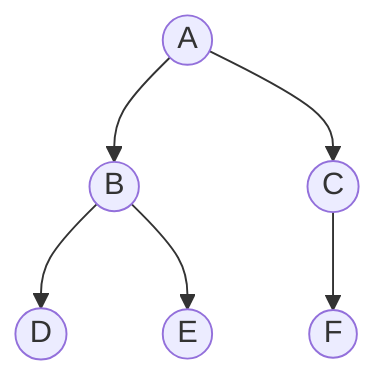

# Binary
A binary tree is a rooted tree in which each node has at most two children, they are identified as left and right child.



## Pseudocode
<pre class="pseudocode">
structure Tree
    attributes:
        Item value
        Tree parent
        Tree left
        Tree right

    methods:
        function insert_left(Tree t)
            if left == Nil then
                t.parent = this
                left = t
        function insert_right(Tree t)
            if right == Nil then
                t.parent = this
                right = t
        function delete_left()
            if left != Nil then
                left.deleteLeft()
                left.deleteRight()
                left = Nil
        function delete_right()
            if right != Nil then
                right.deleteLeft()
                right.deleteRight()
                right = Nil
</pre>

## Implementation
### Python
```py
# implementations/tree.py
```
