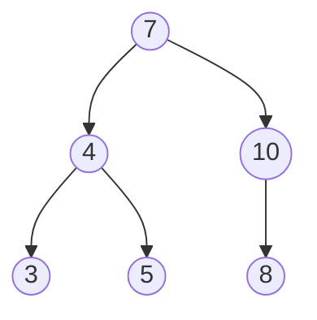
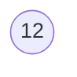
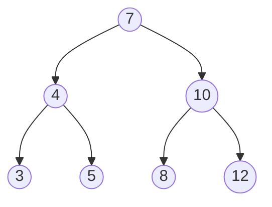
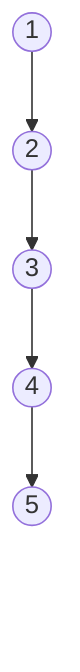

# Insert
Ordered insert in search binary tree.

* **time complexity** → \\(O(n)\\)

**Example**:

Tree before the insert operation

Element to insert

Tree after the insert operation


## Pseudocode
<pre class="pseudocode">
function insert(Item key, Item value)
    Tree parent = tree
    Tree t = parent
    while t \(\ne\) nil and t.key \(\ne\) key do
        parent = t
        if key < t.key then
            t = t.left
        else
            t = t.right

    if t \(\ne\) nil then
        t.value = value
    else
        Tree new_tree = new  Tree(key, value)
        link(parent, new_tree, key)

function link(Tree top, Tree bottom, Item k)
    if key < top.key then
        top.left = bottom
    else
        top.right = bottom

    if bottom \(\ne\) nil then
        bottom.parent = top
</pre>

## Explanation

## Complexity
With \\(n\\) nodes of the original tree the time complexity is \\(O(n)\\).

This is the worst case when elements are inserted ordered

Under the assumption that the binary tree is balanced, the complexity is \\(O(\log n)\\).

## Implementations
### Python
```py
# implementations/insert.py
```
