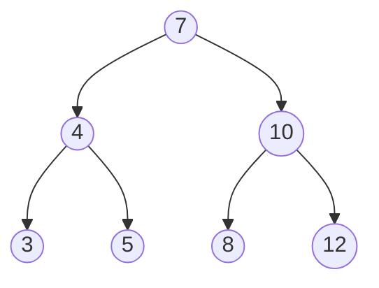

# Min/Max

Given a Binary Search Tree *T*, *min* (or *max*) returns the node with the lowest (or highest) *key*.

* **time complexity** → \\(O(n)\\)

**Example**:



min:


max:


## Pseudocode

<pre class="pseudocode">
function min(BinarySearchTree tree)
    BinarySearchTree u = tree
    if u == Nil then
        return u
    while u.left != Nil then do
        u = u.left
    return u
</pre>

<pre class="pseudocode">
function max(BinarySearchTree tree)
    BinarySearchTree u = tree
    if u == Nil then
        return u
    while u.right != Nil then do
        u = u.right
    return u
</pre>

## Explanation
In a binary search tree the node with the lowest (or highest) key will simply be the leftmost (or rightmost) node, due to tree structure.

## Complexity
With \\(n\\) number of nodes in the tree, the time complexity is \\(O(n)\\).

## Implementations
### Python
```py
# implementations/min_max.py
```