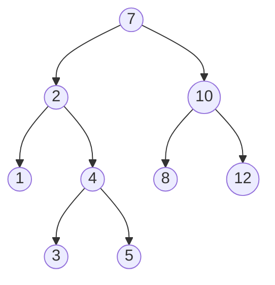

# Predecessor/Successor

Given a Binary Search Tree \\(tree\\) and the *key* \\(k\\) of a node, *predecessor* (or *successor*) returns the predecessor (or the successor) of the node with given \\(k\\).

* **time complexity** → \\(O(n)\\)

**Example**:

Four different cases are possible:
* The predecessor of a node *with* a left child is the node contained in its left subtree with the highest key, e.g. the predecessor of 4 is 3.

* The successor of on a node *with* a right child is the node contained in its rigth subtree with the lowest key, e.g. the predecessor of 2 is 3.

* The predecessor of a node *without* a left child is the first ancestor (parent, grandparent, ...) with the subtree in which the node is contained as its left child, e.g. the predecessor of 3 is 2

* The successor of a node *without* a right child is the first ancestor (parent, grandparent, ...) with the subtree in which the node is contained as its right child, e.g. the predecessor of 3 is 2
